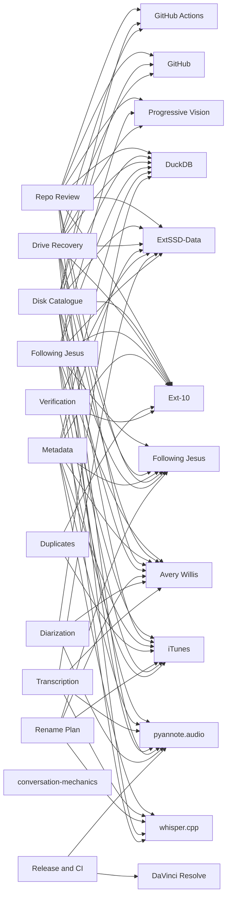

# Graph Map

Up: [Navigation](navigation.md)
This page gives Obsidian a compact hub graph in addition to the full exchange graph.

```mermaid
graph LR
  topic_disk-catalogue["Disk Catalogue"]
  topic_drive-recovery["Drive Recovery"]
  topic_metadata["Metadata"]
  topic_rename-plan["Rename Plan"]
  topic_repo-review["Repo Review"]
  topic_diarization["Diarization"]
  topic_release-ci["Release and CI"]
  topic_transcription["Transcription"]
  topic_verification["Verification"]
  topic_following-jesus["Following Jesus"]
  topic_conversation-mechanics["conversation-mechanics"]
  topic_duplicates["Duplicates"]
  entity_ext-10["Ext-10"]
  entity_avery-willis["Avery Willis"]
  entity_itunes["iTunes"]
  entity_duckdb["DuckDB"]
  entity_pyannote-audio["pyannote.audio"]
  entity_following-jesus["Following Jesus"]
  entity_extssd-data["ExtSSD-Data"]
  entity_whisper-cpp["whisper.cpp"]
  entity_davinci-resolve["DaVinci Resolve"]
  entity_github["GitHub"]
  entity_github-actions["GitHub Actions"]
  entity_progressive-vision["Progressive Vision"]
  topic_repo-review --> entity_duckdb
  topic_repo-review --> entity_github
  topic_repo-review --> entity_github-actions
  topic_disk-catalogue --> entity_duckdb
  topic_disk-catalogue --> entity_github
  topic_disk-catalogue --> entity_github-actions
  topic_drive-recovery --> entity_duckdb
  topic_drive-recovery --> entity_github
  topic_drive-recovery --> entity_github-actions
  topic_repo-review --> entity_ext-10
  topic_disk-catalogue --> entity_ext-10
  topic_drive-recovery --> entity_ext-10
  topic_following-jesus --> entity_avery-willis
  topic_drive-recovery --> entity_avery-willis
  topic_following-jesus --> entity_following-jesus
  topic_following-jesus --> entity_ext-10
  topic_drive-recovery --> entity_following-jesus
  topic_metadata --> entity_following-jesus
  topic_metadata --> entity_avery-willis
  topic_metadata --> entity_ext-10
  topic_repo-review --> entity_following-jesus
  topic_repo-review --> entity_avery-willis
  topic_following-jesus --> entity_itunes
  topic_drive-recovery --> entity_itunes
  topic_metadata --> entity_itunes
  topic_duplicates --> entity_ext-10
  topic_duplicates --> entity_itunes
  topic_rename-plan --> entity_itunes
  topic_disk-catalogue --> entity_following-jesus
  topic_disk-catalogue --> entity_avery-willis
  topic_rename-plan --> entity_following-jesus
  topic_rename-plan --> entity_avery-willis
  topic_repo-review --> entity_progressive-vision
  topic_following-jesus --> entity_progressive-vision
  topic_drive-recovery --> entity_progressive-vision
  topic_repo-review --> entity_extssd-data
  topic_disk-catalogue --> entity_extssd-data
  topic_drive-recovery --> entity_extssd-data
  topic_metadata --> entity_extssd-data
  topic_verification --> entity_ext-10
  topic_verification --> entity_extssd-data
  topic_disk-catalogue --> entity_itunes
  topic_verification --> entity_itunes
  topic_metadata --> entity_whisper-cpp
  topic_transcription --> entity_whisper-cpp
  topic_rename-plan --> entity_whisper-cpp
  topic_drive-recovery --> entity_whisper-cpp
  topic_transcription --> entity_extssd-data
  topic_following-jesus --> entity_extssd-data
  topic_diarization --> entity_avery-willis
  topic_following-jesus --> entity_pyannote-audio
  topic_following-jesus --> entity_whisper-cpp
  topic_metadata --> entity_pyannote-audio
  topic_transcription --> entity_avery-willis
  topic_transcription --> entity_pyannote-audio
  topic_release-ci --> entity_davinci-resolve
  topic_disk-catalogue --> entity_pyannote-audio
  topic_following-jesus --> entity_duckdb
  topic_metadata --> entity_duckdb
  topic_repo-review --> entity_pyannote-audio
  topic_diarization --> entity_pyannote-audio
  topic_diarization --> entity_duckdb
  topic_release-ci --> entity_pyannote-audio
```
